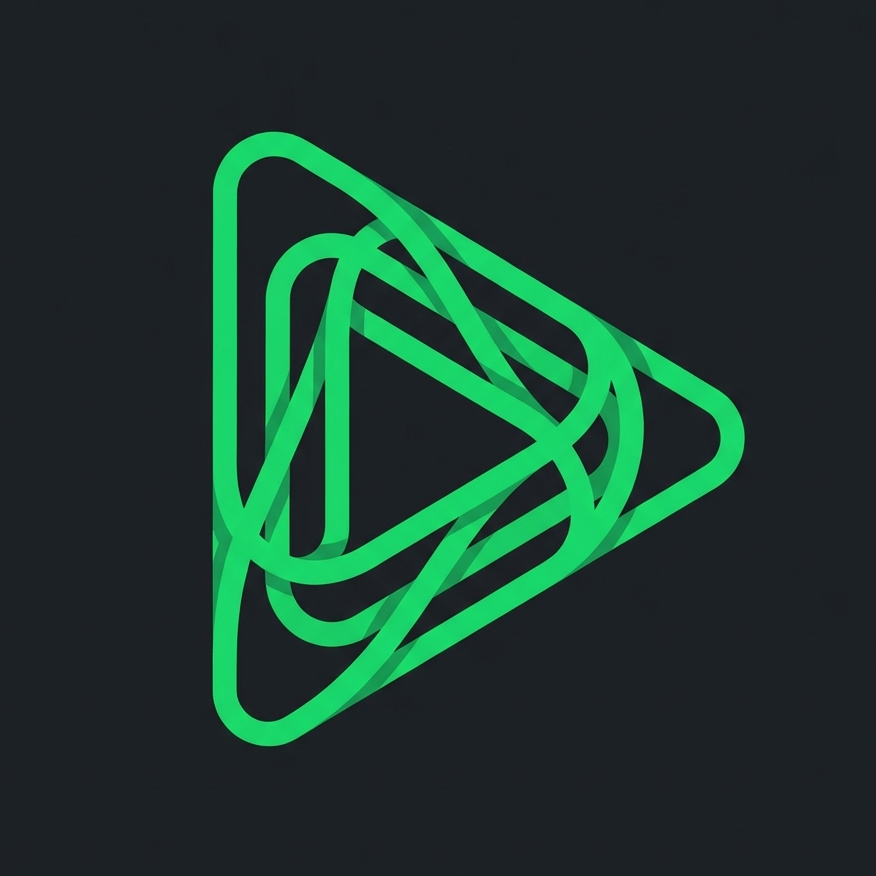

# Onyx Player

**Onyx** is a modern, sleek, and powerful desktop music player built with **Svelte 5**, **Electron**, and **Node.js**. It combines the best of both worlds: Spotify's metadata & recommendation engine with YouTube's vast audio library.



## Features

- **Modern UI/UX**: Glassmorphism design, dark mode by default, and smooth animations.
- **Smart Streaming**: Uses Spotify for metadata/search and YouTube for audio streaming (best match algorithm).
- **Dynamic Visualizer**: Real-time audio visualizer (`audiomotion-analyzer`) that adapts colors from the album art (`colorthief`).
- **Smart Queue**: Spotify-like queue system with auto-recommendations when the queue ends.
- **Lyrics Integration**: Synchronized lyrics support.
- **Library Management**: multiple playlists, favorites, and history tracking.
- **Privacy Focused**: data stored locally `user/appdata`.

## Tech Stack

- **Frontend**: Svelte 5, Vite 5
- **Desktop**: Electron 39
- **Backend**: Express (Node.js)
- **Audio Engine**: `youtube-dl-exec` / `youtube-sr` (Stream via Proxy)
- **Data Source**: `spotify-web-api-node`
- **Visuals**: `audiomotion-analyzer`, `colorthief`

## Getting Started

### Prerequisites
- Node.js (v18 or later)
- Git
- Spotify Client ID & Secret (for metadata)

### Installation

1. **Clone the repository**
   ```bash
   git clone https://github.com/NotCayaa/onyx-player.git
   cd onyx-player
   ```

2. **Install dependencies**
   ```bash
   npm install
   ```

3. **Configure Environment**
   Create a `.env` file or configure via Settings UI later (Spotify Credentials).

4. **Run Development Mode**
   You need to run both backend and frontend.

   ```bash
   # Terminal 1 - Backend
   npm run dev
   
   # Terminal 2 - Frontend (Vite)
   npm run vite

   # Terminal 3 - Electron
   npm start
   ```

### Building for Production

To build the executable (`.exe` for Windows):

```bash
npm run build:app
```
Output will be in `dist-electron/`.

## Contributing

This project is personal, but contributions are welcome! feel free to open issues or PRs.

## License

[MIT](LICENSE) © 2026 caya8205
